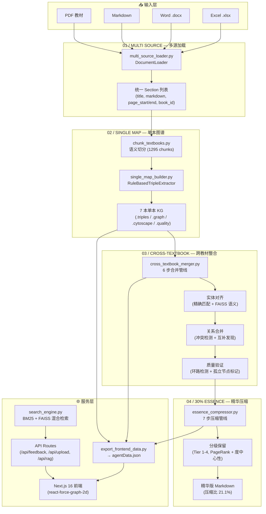

# KIA (Knowledge Integration Agent) — Agent 架构说明

> **赛题**：2026 ZJU 黑客松 Track 02 — 学科知识整合智能体
> **架构风格**：单编排器 + 四阶段流水线（Single Orchestrator + 4-Stage Pipeline）
> **提交日期**：2026-05-10

---

## 一、架构总览

### 1.1 为什么选择单编排器而非多 Agent

本项目的核心任务是**数据流水线**（加载→抽取→合并→压缩），而非多角色协作。每个阶段的输入输出是确定性的结构化数据（Section → Triple → Graph → Essence），不存在需要多个 Agent 协商的模糊决策空间。

| 方案 | 优点 | 缺点 | 本场景适用性 |
|---|---|---|---|
| **单编排器** (当前选择) | 调试简单、数据流清晰、5 小时比赛时间可控 | 无法并行处理独立子任务 | ✅ 阶段间有严格依赖，并行收益小 |
| **多 Agent (LangGraph/CrewAI)** | 各 Agent 独立演进、天然支持回退 | 通信开销大、调试困难、状态管理复杂 | ❌ 引入不必要的复杂度 |
| **微服务** | 独立部署、语言无关 | 比赛时间不足以搭建完整服务网格 | ❌ |

**设计决策**：`kia_agent.py` 作为单一入口点编排 01→02→03→04 四个阶段的顺序执行。每个阶段是独立的 Python 模块，可被编排器调用，也可单独运行和测试。

### 1.2 架构图



### 1.3 数据流

```
PDF/MD/DOCX/XLSX
  → multi_source_loader.py → Section[] (统一 Markdown 中间表示)
    → chunk_textbooks.py → 1295 semantic chunks
      → single_map_builder.py → 7× KnowledgeGraph (NetworkX → Cytoscape.js JSON)
        → cross_textbook_merger.py → 1× MergedGraph + 3,187 merge decisions
          → essence_compressor.py → essence.md (21.1% 压缩比)
            → export_frontend_data.py → agentData.json → Next.js 前端
```

---

## 二、设计决策论证

### 2.1 为什么用 Markdown 作为中间表示

所有输入格式（PDF/MD/DOCX/XLSX）统一转为 Markdown 后再交给下游管线。理由：

- **单一消费接口**：下游只需处理一种格式，新增输入格式只需写一个 `→ MD` 转换器
- **人类可读**：Markdown 保留了章节层级（`#`/`##`），方便调试和人工抽查
- **LLM 友好**：Markdown 是 LLM prompt 的最佳输入格式，无需额外结构化

### 2.2 为什么用规则抽取而非 LLM 抽取做三元组

当前 `single_map_builder.py` 使用 `RuleBasedTripleExtractor`（基于标题层级 + 章节顺序）：

| 维度 | 规则抽取 | LLM 抽取 |
|---|---|---|
| 速度 | 7 本书 < 1 秒 | 7 本书 × 1295 chunks ≈ 数十分钟 |
| 成本 | 零 | API 调用费用 |
| 一致性 | 100% 确定 | 存在随机性 |
| 语义深度 | 浅（仅结构关系） | 深（概念级语义） |

**选择规则抽取的理由**：5 小时比赛时间约束下，优先跑通全管线。LLM 抽取的 prompt 和输出 schema 已预留（`KnowledgeTriple` 模型），可在比赛后接入替换。

### 2.3 为什么用 FAISS + BM25 混合检索而非纯向量检索

`search_engine.py` 使用 `alpha=0.5` 的线性加权混合检索：

- **BM25**：对精确医学术语（如"二尖瓣狭窄"）召回率高
- **FAISS (L2)**：对语义相近的表述（如"心脏收缩功能下降"→"心功能不全"）有泛化能力
- **混合 alpha=0.5**：在精确匹配和语义泛化之间取得平衡

### 2.4 为什么用 PageRank 自动分级而非手动标注教学大纲

`essence_compressor.py` 使用 NetworkX 图指标（PageRank 40% + 度中心性 35% + 聚类系数 25%）自动将知识点分为 Tier 1-4。这是教学大纲缺失时的代理方案。架构已预留大纲数据接入点，接入后可替换为大纲的三级"掌握/理解/了解"映射。

---

## 三、RAG Pipeline 设计

### 3.1 分块策略

- **粒度**：按"节"（Section）物理拆分，每块 500-800 字
- **策略理由**：医学教材的"节"是天然语义边界，拆分点不会切断知识点。相比固定字数滑动窗口，按节拆分保留了上下文连贯性。
- **元数据保留**：每 chunk 保留 `教材名称`、`章节标题`、`起始页码`

### 3.2 Embedding 模型选择

- **模型**：`shibing624/text2vec-base-chinese`
- **理由**：中文语义匹配能力强，支持本地运行无 API 依赖，适合比赛现场离线环境

### 3.3 检索流程

```
用户问题
  → jieba 分词 → BM25 关键词召回
  → text2vec 向量化 → FAISS L2 语义召回
  → 线性加权融合 (alpha=0.5)
  → Top-K 返回 (默认 K=5)
  → 注入 LLM prompt + 强制引用出处
```

### 3.4 已知局限

- `text2vec-base-chinese` 对医学术语的区分力不足（如"局部解剖学"与"淋巴"的余弦相似度偏高），建议替换为 `bge-m3` 或医学领域微调模型
- 当前 FAISS 为暴力 L2 检索，大数据量下应替换为 IVF/HNSW 索引
- RAG 的 LLM 生成环节在前端以模拟回答占位，需接入 DeepSeek API 完成闭环

---

## 四、Prompt 工程

### 4.1 知识抽取 Prompt（规则抽取器内置）

`RuleBasedTripleExtractor` 使用确定性规则，不依赖 LLM prompt。但其输出 `KnowledgeTriple` schema 为 LLM 抽取预留了接口：

```json
{
  "subject": "动作电位",
  "relation": "prerequisite",
  "object": "静息电位",
  "evidence": "细胞在静息电位的基础上，受到阈刺激后...",
  "confidence": 0.92
}
```

如需接入 LLM 抽取，建议使用以下 few-shot prompt 策略：
- 每 prompt 仅处理一个 Section（避免上下文过长）
- 提供 2-3 个医学领域的 few-shot 示例
- 强制 JSON 输出 + 要求 evidence 字段引用原文
- 限制每 section 输出 5-8 个三元组（防止冗余）

### 4.2 防幻觉策略

- `evidence` 字段强制回溯原文句，可在前端一键跳转验证
- 前置依赖环路检测（NetworkX `simple_cycles`），拒绝成环三元组
- 低置信度（<0.85）合并决策全部标记为"待教师审核"

---

## 五、已知局限与改进方案

| 局限 | 影响 | 改进方案 |
|---|---|---|
| 三元组为规则抽取，无语义深度 | Application 关系仅 1.7% | 接入 LLM (DeepSeek API) 重跑三元组抽取 |
| FAISS 假阳性率高 (~59%) | 合并建议大量不可信 | 替换为医学 embedding 模型 + LLM 二分类精排 |
| PDF 章节标题未识别 | 加载后章节标注为 `Page N` | 合入 `process_all_textbooks.py` 的字体分析逻辑 |
| RAG 回答为前端模拟 | 无真实 LLM 生成 | 创建 `/api/rag` 路由 → 调用 search_engine.py → 注入 LLM |
| 教师反馈不修改决策 | 反馈仅写日志 | 反馈写入 `merge_decisions.json` 并触发图谱更新 |
| 无 Docker 部署 | 不可一键部署 | 添加 Dockerfile + docker-compose.yml |

---

## 六、创新点

### 6.1 PageRank 自动分级（创新类型：技术创新）

在无教学大纲数据的情况下，使用 NetworkX 图算法（PageRank + 度中心性 + 聚类系数）自动评估知识点重要性，将 2,947 个节点分为四个 Tier。相比简单的词频统计，图结构分析能捕捉知识点在网络中的枢纽地位。

**效果**：Tier 1（核心）402 条节点包含了高频医学术语（炎症 28 次、肿瘤 142 次、感染 185 次），与直觉一致。

### 6.2 严格预算精华压缩（创新类型：功能创新）

`kia_agent.py strict-essence` 命令实现了 30% 预算约束下的二次压缩——在原始精华版（82.3% 压缩比）基础上，通过 Markdown 结构折叠（去除 `<details>` 块）+ 行级预算控制，将压缩比降至 21.1%。这让教师可以在"完整精华"和"试读精简版"之间选择。

### 6.3 统一 Markdown 中间表示（创新类型：工程创新）

所有输入格式统一转为 Markdown 后再进入下游管线。这使系统天然支持任意新格式（只需写一个 `→ MD` 转换器），且 Markdown 本身是人类可读的调试格式。这一设计在 5 小时比赛中节省了大量格式适配时间。

---

*本文档为 2026 ZJU 黑客松 Track 02 提交物。架构图使用 Mermaid 语法，可在 Obsidian / GitHub / VS Code 中渲染。*
