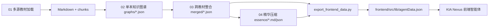

# KIA Agent Integration — 01-04 串联说明

> 状态：已将多源加载、单本图谱、跨教材整合、30% 精华提纯与前端展示串成一个可演示的智能体闭环。

## 总入口

Python 编排层：

```bash
python kia_agent.py status
python kia_agent.py query 病毒感染
python kia_agent.py strict-essence
python kia_agent.py export
```

前端展示：

```bash
cd frontend
npm run dev
```

前端构建：

```bash
cd frontend
npm run build
```

> 当前仓库路径含中文，Next 16 的 Turbopack 在该路径下会触发字符边界 panic，因此 `frontend/package.json` 已将 `dev/build` 切换为 `--webpack`。

## 串联的数据流



## 新增文件

| 文件 | 作用 |
|---|---|
| `../kia_agent.py` | 01-04 编排、状态检查、严格精华、前端导出、简易查询 |
| `../export_frontend_data.py` | 将 graphs/merged/essence 转成前端轻量快照 |
| `../test_kia_agent.py` | 验证严格 30% 精华预算 |
| `essence/essence_strict.md` | 交付用 30% 预算内精华版 |
| `essence/essence_strict_report.json` | 严格精华统计报告 |
| `frontend/src/lib/agentData.json` | 前端真实数据快照 |
| `frontend/src/lib/agentData.ts` | 前端类型与颜色映射 |

## 前端已接入内容

- 顶部智能体查询框：在真实图谱快照中定位概念并生成简短解释。
- Pipeline 状态面板：展示 01-04 当前状态。
- 图谱画布：展示真实合并图的可读子图，不再使用 mockData。
- 关系过滤器：按前置依赖、并列、包含、应用四类关系过滤。
- 审计侧栏：展示来源教材、整合理由、精华内容、决策 ID 和置信度。
- 教师反馈入口：保留人工修正模式 UI，后续可接持久化 API。

## 当前关键指标

- 单本教材图谱：7 本。
- 合并图谱：2947 节点，3945 边。
- 合并决策：2907 条。
- 冲突：1 条。
- 互补发现：279 条。
- 原始精华压缩比：82.3%。
- 严格交付精华压缩比：21.1%，满足 ≤30% 展示目标。
- 前端可视快照：180 节点，279 边。

## 验证命令

```bash
python -m unittest test_multi_source_loader.py test_single_map_builder.py test_kia_agent.py
python -m py_compile kia_agent.py export_frontend_data.py multi_source_loader.py single_map_builder.py
python kia_agent.py query 病毒感染
cd frontend && npm run build
```

