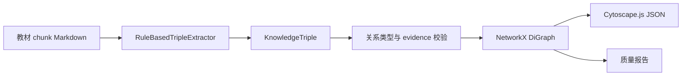

# 02 / SINGLE MAP — 单本教材知识图谱构建实现说明

> 状态：已实现单本教材独立图谱构建，可导出 NetworkX 与 Cytoscape.js JSON。

## 目标

为每一本教材独立构建知识图谱，强制使用四种关系类型：

| 关系 | 英文字段 | 说明 |
|---|---|---|
| 前置依赖 | `prerequisite` | A 是学习或理解 B 的前提 |
| 并列关系 | `parallel` | A 与 B 是同级、同类概念 |
| 包含关系 | `containment` | A 包含 B |
| 应用关系 | `application` | A 的知识应用于 B |

## 实现入口

核心脚本：

```bash
python single_map_builder.py --chunks-dir 生医黑客松/chunks --output-dir 生医黑客松/graphs
```

构建单本教材：

```bash
python single_map_builder.py --book 03_生理学
```

## 数据流



## 抽取策略

- `containment`：从教材目录、章节、小节、子标题层级抽取。
- `parallel`：从同一小节下相邻同级标题抽取。
- `prerequisite`：从教材内小节顺序抽取，并在加入前检查是否会造成前置依赖环路。
- `application`：从包含“用于 / 有助于 / 诊断 / 治疗 / 防治 / 预防 / 评估 / 临床”等高置信模式的证据句抽取。

默认规则抽取器优先保证比赛现场可复现与离线稳定。后续接入 LLM 时，只要输出同样的 `KnowledgeTriple` schema，即可复用校验和导出层。

## 输出文件

每本教材输出 4 个文件，位于 `graphs/`：

| 文件 | 用途 |
|---|---|
| `{book}.triples.json` | 标准三元组列表，含 evidence 与 source path |
| `{book}.graph.json` | NetworkX node-link JSON |
| `{book}.cytoscape.json` | 前端 Cytoscape.js 可直接消费的 elements |
| `{book}.quality.json` | 节点数、边数、关系分布、前置依赖环路、低度节点等质量报告 |

## 当前全量结果

| 教材 | 节点 | 边 | 三元组 | 前置依赖环路 |
|---|---:|---:|---:|---:|
| `01_局部解剖学` | 468 | 657 | 764 | 0 |
| `02_组织学与胚胎学` | 289 | 849 | 1132 | 0 |
| `03_生理学` | 1014 | 908 | 935 | 0 |
| `04_医学微生物学` | 953 | 1343 | 1648 | 0 |
| `05_病理学` | 1902 | 2022 | 2120 | 0 |
| `06_传染病学` | 2347 | 2492 | 2625 | 0 |
| `07_病理生理学` | 1580 | 1927 | 2156 | 0 |

### 2026-05-10 烟测修复后的关系分布

| 教材 | 前置依赖 | 并列 | 包含 | 应用 | 环路 |
|---|---:|---:|---:|---:|---:|
| `01_局部解剖学` | 199 | 94 | 201 | 163 | 0 |
| `02_组织学与胚胎学` | 281 | 281 | 281 | 6 | 0 |
| `03_生理学` | 124 | 27 | 191 | 566 | 0 |
| `04_医学微生物学` | 279 | 94 | 454 | 516 | 0 |
| `05_病理学` | 264 | 98 | 332 | 1328 | 0 |
| `06_传染病学` | 205 | 129 | 278 | 1880 | 0 |
| `07_病理生理学` | 404 | 222 | 442 | 859 | 0 |

针对烟测指出的问题，本次补强：

- 对 `02_组织学与胚胎学` 这种 chunk 过少的教材，自动回退读取 Obsidian 根目录中的整本 Markdown，并按一级标题切分虚拟 chunk，避免前置依赖只剩 1 条。
- 在 chunk 内按标题顺序补充 `prerequisite`，并保持环路检测。
- `parallel` 改为双向表达；导出时优先保留同向 `prerequisite`，反向边保留 `parallel`，避免质量报告漏计前置关系。
- `application` 扩展到“临床 / 疾病 / 病理 / 异常 / 检查 / 药物 / 靶点”等证据句，同时对 “从而 / 一种 / 系统的 / 主要”等碎片节点做前置过滤。

## 验证

```bash
python -m unittest test_single_map_builder.py
python -m py_compile single_map_builder.py
python single_map_builder.py --chunks-dir 生医黑客松/chunks --output-dir 生医黑客松/graphs
```
